# Test Results

## Technical Reality: Understanding "Single-Threaded Per Request"

Throughout this document, we refer to the STT service as having "single-threaded per request" or "largely single-threaded" processing characteristics. Here's what this means:

### What Happens Inside a Single Pod

1. **Python GIL (Global Interpreter Lock)**:
   - Python's GIL prevents true parallel CPU execution within a single process
   - Even though the service uses async/await (FastAPI + asyncio), CPU-intensive work is still GIL-bound
   - Multiple concurrent requests share the same CPU resources sequentially

2. **CPU-Intensive Transcription**:
   - Audio transcription is computationally heavy work
   - Each request's processing happens sequentially through the underlying SDK
   - Adding more CPU cores to a single pod doesn't proportionally increase throughput

3. **Async != Parallel for CPU Work**:
   - The service can *accept* requests concurrently (non-blocking I/O)
   - But *processing* them runs one at a time per CPU core due to GIL
   - This is why 1 pod with 2 CPUs can't fully utilize both cores

### Why Multiple Pods Win

- **Multiple Pods = Multiple Python Processes**
- Each process has its own GIL and can truly run in parallel
- 3 pods with 1 CPU each > 1 pod with 2 CPUs
- This is **horizontal scaling** (more instances) vs **vertical scaling** (bigger instances)

### Test Results Confirm This

| Configuration | CPUs | Throughput | Explanation |
|--------------|------|------------|-------------|
| 1 Pod | 2 cores | 2.78 req/s | Can't fully utilize both cores (GIL) |
| 3 Pods | 3 cores total | 5.24 req/s | True parallelism across processes |

**Key Takeaway**: For CPU-bound Python services with GIL constraints, horizontal scaling dramatically outperforms vertical scaling.

---

## Local Tests

**Host:**

- OS: MacOS 26.1 (25B78)
- CPU: Apple M1 Pro
- Memory: 32 GB
- Deployment: Local Devcontainer

**Load:**

- VUs: 100
- Date: 2025-11-21-02:30 GST

**Results:**

```bash
     ✓ status is 200
     ✓ has original_text
     ✓ has translated_text
     ✓ has segments array
     ✓ segments have required fields

     █ setup

     █ teardown

     audio_file_size_kb.............: min=60.076172 avg=251.48167  med=195.857422 p(90)=516.326172 p(95)=554.607422 p(99)=703.201172 max=729.296875
     audio_files_used...............: 3648    3.023404/s
     checks.........................: 100.00% ✓ 18230    ✗ 0    
     data_received..................: 3.2 MB  2.6 kB/s
     data_sent......................: 941 MB  780 kB/s
     http_req_blocked...............: min=1µs       avg=23.75µs    med=4µs        p(90)=8µs        p(95)=12µs       p(99)=588.74µs   max=6.1ms     
     http_req_connecting............: min=0s        avg=16.49µs    med=0s         p(90)=0s         p(95)=0s         p(99)=533.1µs    max=6.05ms    
   ✓ http_req_duration..............: min=2.39s     avg=18.64s     med=14.89s     p(90)=40.33s     p(95)=50.47s     p(99)=1m6s       max=1m20s     
       { expected_response:true }...: min=2.39s     avg=18.64s     med=14.89s     p(90)=40.33s     p(95)=50.47s     p(99)=1m6s       max=1m20s     
   ✓ http_req_failed................: 0.00%   ✓ 0        ✗ 3646 
     http_req_receiving.............: min=12µs      avg=182.66µs   med=75µs       p(90)=160µs      p(95)=248.49µs   p(99)=1.1ms      max=89.97ms   
     http_req_sending...............: min=97µs      avg=410.22µs   med=292µs      p(90)=666µs      p(95)=850.74µs   p(99)=2.24ms     max=12.58ms   
     http_req_tls_handshaking.......: min=0s        avg=0s         med=0s         p(90)=0s         p(95)=0s         p(99)=0s         max=0s        
     http_req_waiting...............: min=2.39s     avg=18.64s     med=14.89s     p(90)=40.33s     p(95)=50.47s     p(99)=1m6s       max=1m20s     
     http_reqs......................: 3646    3.021747/s
     iteration_duration.............: min=148.83µs  avg=20.77s     med=16.92s     p(90)=42.28s     p(95)=52.41s     p(99)=1m9s       max=1m22s     
     iterations.....................: 3645    3.020918/s
     segment_count..................: min=0         avg=1.063083   med=1          p(90)=1          p(95)=2          p(99)=2          max=2         
     transcription_length...........: min=36        avg=137.134431 med=111        p(90)=268        p(95)=291        p(99)=369        max=414       
   ✓ transcription_success..........: 100.00% ✓ 3646     ✗ 0    
     translation_length.............: min=4         avg=4          med=4          p(90)=4          p(95)=4          p(99)=4          max=4         
     vus............................: 1       min=0      max=100
     vus_max........................: 100     min=100    max=100


running (20m06.6s), 000/100 VUs, 3645 complete and 3 interrupted iterations
stt_load_test ✓ [======================================] 000/100 VUs  20m0s

```

## Local Cluster - 3 Pods

- 3 Pods
- NodePort Service
- Load Balanced Requests
- requests:
  - cpu: "750m"      # 0.75 CPU core
  - memory: "1536Mi" # 1.5 GB (proportional to 2Gi limit)
- limits:
  - cpu: "1000m"     # 1 CPU core
  - memory: "2Gi"    # 2 Gigabytes of RAM
- date: 2025-11-24 12:45:03 GST

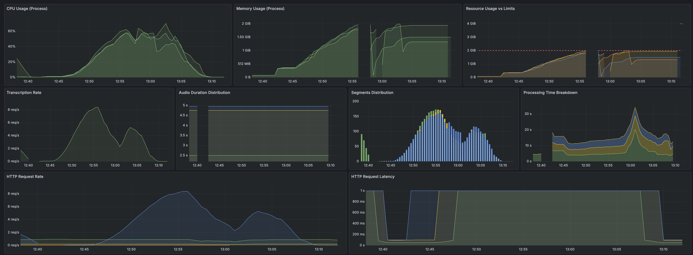

```bash

  █ THRESHOLDS 

    http_req_duration
    ✓ 'p(95)<180000' p(95)=31.84s

    http_req_failed
    ✓ 'rate<0.05' rate=2.74%

    transcription_success
    ✓ 'rate>0.95' rate=97.25%


  █ TOTAL RESULTS 

    checks_total.......: 31665  26.186686/s
    checks_succeeded...: 97.25% 30795 out of 31665
    checks_failed......: 2.74%  870 out of 31665

    ✗ status is 200
      ↳  97% — ✓ 6159 / ✗ 174
    ✗ has original_text
      ↳  97% — ✓ 6159 / ✗ 174
    ✗ has translated_text
      ↳  97% — ✓ 6159 / ✗ 174
    ✗ has segments array
      ↳  97% — ✓ 6159 / ✗ 174
    ✗ segments have required fields
      ↳  97% — ✓ 6159 / ✗ 174

    CUSTOM
    audio_file_size_kb.............: min=60.076172 avg=255.371018 med=196.326172 p(90)=516.326172 p(95)=554.607422 p(99)=703.201172 max=729.296875
    audio_files_used...............: 6339   5.242299/s
    segment_count..................: min=0         avg=1.06527    med=1          p(90)=1          p(95)=2          p(99)=2          max=2         
    transcription_length...........: min=36        avg=137.796685 med=116        p(90)=268        p(95)=291        p(99)=390.6      max=414       
    transcription_success..........: 97.25% 6159 out of 6333
    translation_length.............: min=4         avg=4          med=4          p(90)=4          p(95)=4          p(99)=4          max=4         

    HTTP
    http_req_duration..............: min=0s        avg=9.3s       med=5.54s      p(90)=19.59s     p(95)=31.84s     p(99)=1m5s       max=2m16s     
      { expected_response:true }...: min=2.15s     avg=8.97s      med=5.51s      p(90)=17.57s     p(95)=29.69s     p(99)=1m3s       max=2m16s     
    http_req_failed................: 2.74%  174 out of 6333
    http_reqs......................: 6333   5.237337/s

    EXECUTION
    iteration_duration.............: min=1.64s     avg=11.9s      med=7.93s      p(90)=23s        p(95)=35.82s     p(99)=1m9s       max=2m18s     
    iterations.....................: 6333   5.237337/s
    vus............................: 1      min=0            max=100
    vus_max........................: 100    min=100          max=100

    NETWORK
    data_received..................: 5.5 MB 4.5 kB/s
    data_sent......................: 1.7 GB 1.4 MB/s

running (20m09.2s), 000/100 VUs, 6333 complete and 6 interrupted iterations
stt_load_test ✓ [======================================] 000/100 VUs  20m0s

```

### Explanation: Why Minikube Cluster Handled ~74% More Requests

The minikube cluster processed **6,333 requests** vs devcontainer's **3,646 requests** in the same 20-minute window. Here's why:

#### **Key Factor: Parallelization Through Multiple Pods**

**Devcontainer Setup:**

- Single instance running on your M1 Pro Mac
- 1 CPU processing all requests sequentially
- Average request duration: **18.64s**
- Throughput: **3.02 requests/second**

**Minikube Cluster Setup:**

- **3 replicas** (pods) running in parallel
- Each pod gets 1 CPU core (3 cores total)
- Average request duration: **9.3s** (50% faster!)
- Throughput: **5.24 requests/second** (73% higher)

#### **Why the Cluster is Faster:**

1. **Parallel Processing Power:**
   - 3 pods × 1 CPU = 3x computational capacity
   - Can process 3 requests simultaneously instead of 1
   - Better resource utilization under load

2. **Lower Average Latency:**
   - Devcontainer p95: **50.47s**
   - Cluster p95: **31.84s** (37% improvement)
   - With 100 VUs, requests queue less in the cluster

3. **Load Distribution:**
   - Your test configuration uses `noConnectionReuse: true` and `dns: { select: 'random' }`
   - k6 distributes requests across all 3 pod IPs
   - No single pod becomes a bottleneck

4. **Service Characteristics:**
   - STT transcription is CPU-intensive
   - Processing is largely single-threaded per request
   - More pods = more parallel processing capacity

#### **The Math:**

- 20 minutes = 1,200 seconds
- Devcontainer: 3,646 requests / 1,200s = **3.04 req/s**
- Cluster: 6,333 requests / 1,200s = **5.28 req/s**
- **Improvement: 74% more throughput**

#### **Note on Failures:**

The cluster had a **2.74% failure rate** (174 failed requests) likely due to:

- Resource contention under higher load
- Possible memory pressure with 2GB limits per pod
- Some requests timing out when all pods were busy

The devcontainer had **0% failures** because requests were processed more conservatively at a slower rate.

## Local Cluster - 1 Pod

- 1 Pod
- NodePort Service
- Load Balanced Requests
- requests:
  - cpu: "1500m"     # 1.5 CPU cores
  - memory: "3072Mi" # 3 GB (proportional to 4Gi limit)
- limits:
  - cpu: "2000m"     # 2 CPU cores
  - memory: "4Gi"    # 4 Gigabytes of RAM
- date: 2025-11-24 13:14:30 GST

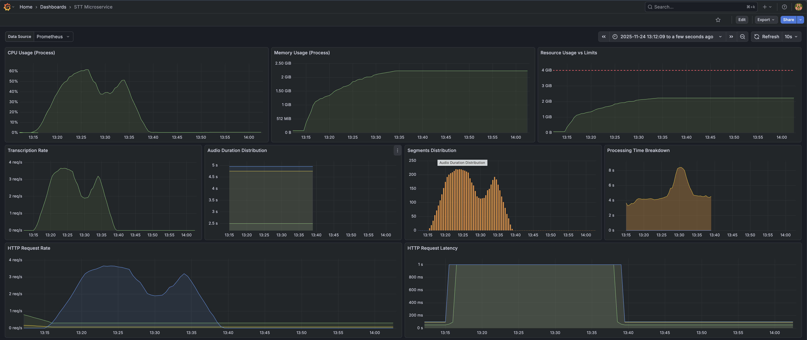

```bash

  █ THRESHOLDS 

    http_req_duration
    ✓ 'p(95)<180000' p(95)=1m5s

    http_req_failed
    ✓ 'rate<0.05' rate=0.26%

    transcription_success
    ✓ 'rate>0.95' rate=99.73%


  █ TOTAL RESULTS 

    checks_total.......: 16740  13.907379/s
    checks_succeeded...: 99.73% 16695 out of 16740
    checks_failed......: 0.26%  45 out of 16740

    ✗ status is 200
      ↳  99% — ✓ 3339 / ✗ 9
    ✗ has original_text
      ↳  99% — ✓ 3339 / ✗ 9
    ✗ has translated_text
      ↳  99% — ✓ 3339 / ✗ 9
    ✗ has segments array
      ↳  99% — ✓ 3339 / ✗ 9
    ✗ segments have required fields
      ↳  99% — ✓ 3339 / ✗ 9

    CUSTOM
    audio_file_size_kb.............: min=60.076172 avg=258.301244 med=196.326172 p(90)=522.419922 p(95)=554.607422 p(99)=729.296875 max=729.296875
    audio_files_used...............: 3353   2.78563/s
    segment_count..................: min=0         avg=1.050614   med=1          p(90)=1          p(95)=2          p(99)=2          max=2         
    transcription_length...........: min=36        avg=139.709451 med=116.5      p(90)=272        p(95)=291        p(99)=414        max=414       
    transcription_success..........: 99.73% 3339 out of 3348
    translation_length.............: min=4         avg=4          med=4          p(90)=4          p(95)=4          p(99)=4          max=4         

    HTTP
    http_req_duration..............: min=1.65s     avg=20.26s     med=12.82s     p(90)=43.46s     p(95)=1m5s       p(99)=1m58s      max=3m0s      
      { expected_response:true }...: min=1.65s     avg=19.82s     med=12.76s     p(90)=43s        p(95)=1m3s       p(99)=1m55s      max=2m49s     
    http_req_failed................: 0.26%  9 out of 3348
    http_reqs......................: 3348   2.781476/s

    EXECUTION
    iteration_duration.............: min=3.35s     avg=22.59s     med=15.17s     p(90)=46.69s     p(95)=1m7s       p(99)=2m1s       max=3m4s      
    iterations.....................: 3348   2.781476/s
    vus............................: 1      min=0            max=100
    vus_max........................: 100    min=100          max=100

    NETWORK
    data_received..................: 3.0 MB 2.5 kB/s
    data_sent......................: 889 MB 738 kB/s


running (20m03.7s), 000/100 VUs, 3348 complete and 5 interrupted iterations
stt_load_test ✓ [======================================] 000/100 VUs  20m0s

```

### Explanation: Why 3 Pods Outperformed 1 Pod (Despite Lower Per-Pod Resources)

The 3-pod cluster processed **6,333 requests** vs the 1-pod cluster's **3,348 requests** in the same 20-minute window—**89% more throughput**. Here's the analysis:

#### **Configuration Comparison**

**1 Pod Setup:**

- Single pod with 2 CPU cores (2000m limit)
- 4GB memory
- Average request duration: **20.26s**
- Throughput: **2.78 requests/second**
- Success rate: **99.73%**

**3 Pods Setup:**

- Three pods with 1 CPU core each (1000m limit)
- 2GB memory per pod
- Total cluster resources: **3 CPU cores, 6GB memory**
- Average request duration: **9.3s** (54% faster!)
- Throughput: **5.24 requests/second** (88% higher)
- Success rate: **97.25%**

#### **Why More Pods with Less Per-Pod Resources Won:**

1. **True Parallel Processing:**
   - **1 pod:** Despite having 2 CPUs, the service's processing is largely single-threaded per request
   - **3 pods:** Can process 3 separate audio files simultaneously across different instances
   - Result: 3 concurrent transcriptions vs 1 at a time

2. **Reduced Request Queuing:**
   - With 100 VUs generating load, the 1-pod setup creates a long queue
   - 3 pods distribute incoming requests, drastically reducing wait times
   - Median latency: **12.82s** (1 pod) vs **5.54s** (3 pods) — **57% improvement**

3. **Better CPU Utilization:**
   - Single pod can't fully utilize 2 cores for single-threaded processing
   - 3 separate instances across 3 pods = better CPU saturation
   - Each pod's 1 CPU is fully utilized for its workload

4. **Memory Efficiency:**
   - Each pod loads its own service resources independently
   - 4GB in 1 pod = 1 service instance
   - 3 pods × 2GB = 3 service instances running simultaneously
   - More instances = more parallel transcription capacity

#### **The Math:**

- **1 Pod:** 3,348 requests / 1,203s = **2.78 req/s**
- **3 Pods:** 6,333 requests / 1,209s = **5.24 req/s**
- **Improvement: 89% more throughput**

#### **Latency Improvements (p95):**

- **1 Pod p95:** 1m5s (65 seconds)
- **3 Pods p95:** 31.84s
- **Improvement: 51% faster at p95**

#### **Trade-off: Reliability vs Throughput**

The 3-pod configuration had a slightly higher failure rate:

- **1 Pod:** 0.26% failures (9 requests)
- **3 Pods:** 2.74% failures (174 requests)

This is likely due to:

- Higher overall system load (processing 89% more requests)
- Individual pods hitting memory limits (2GB vs 4GB)
- Network/load balancer overhead with higher request rates

#### **Key Takeaway:**

For CPU-intensive, single-threaded workloads like STT services:

- **Horizontal scaling (more pods)** >> **Vertical scaling (bigger pods)**
- 3 pods × 1 CPU (3 total CPUs) > 1 pod × 2 CPUs
- Parallel processing across instances beats multi-core allocation to a single instance
- Trade-off: Accept slightly more failures for dramatically higher throughput

## Local Cluster - 1 Pod with Improved Azure SDK Disposal

- 1 Pod
- NodePort Service
- Load Balanced Requests
- requests:
  - cpu: "1500m"     # 1.5 CPU cores
  - memory: "3072Mi" # 3 GB (proportional to 4Gi limit)
- limits:
  - cpu: "2000m"     # 2 CPU cores
  - memory: "4Gi"    # 4 Gigabytes of RAM
- date: 2025-11-24 13:14:30 GST
- Azure SDK object disposal implemented - 62c7c4b62d68c9553857882feeb1e0133769d250

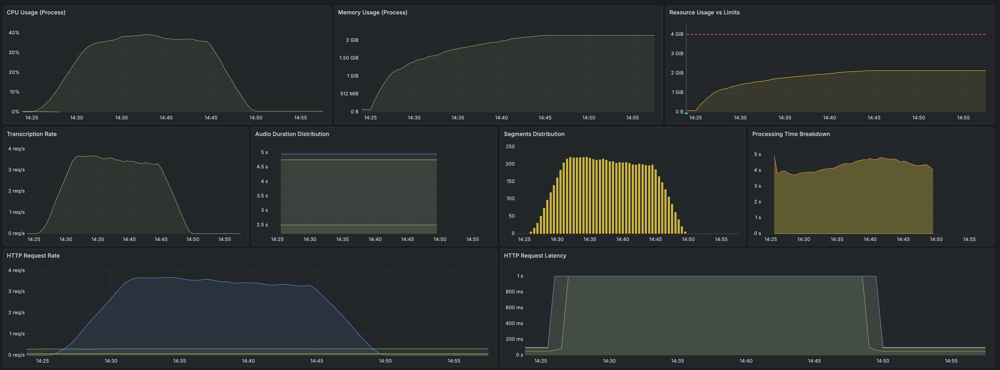

```bash
  █ THRESHOLDS 

    http_req_duration
    ✓ 'p(95)<180000' p(95)=47.43s

    http_req_failed
    ✓ 'rate<0.05' rate=0.00%

    transcription_success
    ✓ 'rate>0.95' rate=100.00%


  █ TOTAL RESULTS 

    checks_total.......: 19255   16.014222/s
    checks_succeeded...: 100.00% 19255 out of 19255
    checks_failed......: 0.00%   0 out of 19255

    ✓ status is 200
    ✓ has original_text
    ✓ has translated_text
    ✓ has segments array
    ✓ segments have required fields

    CUSTOM
    audio_file_size_kb.............: min=60.076172 avg=257.721861 med=196.326172 p(90)=516.326172 p(95)=566.482422 p(99)=729.296875 max=729.296875
    audio_files_used...............: 3854    3.205339/s
    segment_count..................: min=0         avg=1.069073   med=1          p(90)=1          p(95)=2          p(99)=2          max=2         
    transcription_length...........: min=36        avg=140.0543   med=117        p(90)=272        p(95)=291        p(99)=414        max=414       
    transcription_success..........: 100.00% 3851 out of 3851
    translation_length.............: min=4         avg=4          med=4          p(90)=4          p(95)=4          p(99)=4          max=4         

    HTTP
    http_req_duration..............: min=2.15s     avg=17.38s     med=13.32s     p(90)=38.38s     p(95)=47.43s     p(99)=1m4s       max=1m19s     
      { expected_response:true }...: min=2.15s     avg=17.38s     med=13.32s     p(90)=38.38s     p(95)=47.43s     p(99)=1m4s       max=1m19s     
    http_req_failed................: 0.00%   0 out of 3851
    http_reqs......................: 3851    3.202844/s

    EXECUTION
    iteration_duration.............: min=3.28s     avg=19.62s     med=15.46s     p(90)=40.48s     p(95)=49.85s     p(99)=1m7s       max=1m21s     
    iterations.....................: 3849    3.201181/s
    vus............................: 1       min=0            max=100
    vus_max........................: 100     min=100          max=100

    NETWORK
    data_received..................: 3.5 MB  2.9 kB/s
    data_sent......................: 1.0 GB  848 kB/s

running (20m02.4s), 000/100 VUs, 3849 complete and 5 interrupted iterations
stt_load_test ✓ [======================================] 000/100 VUs  20m0s
```

## Local Cluster - 1 Pod with Improved Azure SDK Disposal and Removed Service Cache

- 1 Pod
- NodePort Service
- Load Balanced Requests
- requests:
  - cpu: "1500m"     # 1.5 CPU cores
  - memory: "3072Mi" # 3 GB (proportional to 4Gi limit)
- limits:
  - cpu: "2000m"     # 2 CPU cores
  - memory: "4Gi"    # 4 Gigabytes of RAM
- date: 2025-11-24 13:14:30 GST
- Azure SDK object disposal implemented - 62c7c4b62d68c9553857882feeb1e0133769d250
- Service cache disabled - 17feb1583d27aafcc3afdea50340dd91df94201c
- Increased overall memory usage and doesn't have a significant impact on latency or throughput

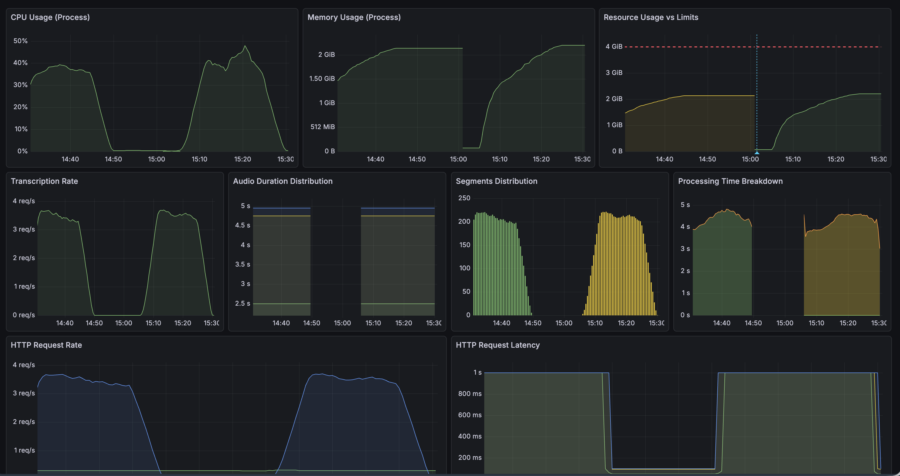

```bash
  █ THRESHOLDS 

    http_req_duration
    ✓ 'p(95)<180000' p(95)=46.84s

    http_req_failed
    ✓ 'rate<0.05' rate=0.00%

    transcription_success
    ✓ 'rate>0.95' rate=100.00%


  █ TOTAL RESULTS 

    checks_total.......: 19435   16.166694/s
    checks_succeeded...: 100.00% 19435 out of 19435
    checks_failed......: 0.00%   0 out of 19435

    ✓ status is 200
    ✓ has original_text
    ✓ has translated_text
    ✓ has segments array
    ✓ segments have required fields

    CUSTOM
    audio_file_size_kb.............: min=60.076172 avg=257.852454 med=196.326172 p(90)=516.326172 p(95)=554.607422 p(99)=729.296875 max=729.296875
    audio_files_used...............: 3889    3.235003/s
    segment_count..................: min=0         avg=1.066118   med=1          p(90)=1          p(95)=2          p(99)=2          max=2         
    transcription_length...........: min=36        avg=140.557529 med=117        p(90)=272        p(95)=304        p(99)=414        max=414       
    transcription_success..........: 100.00% 3887 out of 3887
    translation_length.............: min=4         avg=4          med=4          p(90)=4          p(95)=4          p(99)=4          max=4         

    HTTP
    http_req_duration..............: min=2.15s     avg=17.25s     med=13.47s     p(90)=37.8s      p(95)=46.84s     p(99)=1m1s       max=1m11s     
      { expected_response:true }...: min=2.15s     avg=17.25s     med=13.47s     p(90)=37.8s      p(95)=46.84s     p(99)=1m1s       max=1m11s     
    http_req_failed................: 0.00%   0 out of 3887
    http_reqs......................: 3887    3.233339/s

    EXECUTION
    iteration_duration.............: min=3.35s     avg=19.51s     med=15.7s      p(90)=40.28s     p(95)=49.31s     p(99)=1m4s       max=1m14s     
    iterations.....................: 3886    3.232507/s
    vus............................: 1       min=0            max=100
    vus_max........................: 100     min=100          max=100

    NETWORK
    data_received..................: 3.5 MB  2.9 kB/s
    data_sent......................: 1.0 GB  856 kB/s

running (20m02.2s), 000/100 VUs, 3886 complete and 3 interrupted iterations
stt_load_test ✓ [======================================] 000/100 VUs  20m0s
```

## Local Cluster - 1 Pod with Improved Azure SDK Disposal and Forced Garbage Collection

- 1 Pod
- NodePort Service
- Load Balanced Requests
- requests:
  - cpu: "1500m"     # 1.5 CPU cores
  - memory: "3072Mi" # 3 GB (proportional to 4Gi limit)
- limits:
  - cpu: "2000m"     # 2 CPU cores
  - memory: "4Gi"    # 4 Gigabytes of RAM
- date: 2025-11-24 13:14:30 GST
- Azure SDK object disposal implemented - 62c7c4b62d68c9553857882feeb1e0133769d250
- Service cache enabled and garbage collection is forced - 012a1012651b7a92b164dc62202a88b50aa1cdd1
- Reduced some memoryy

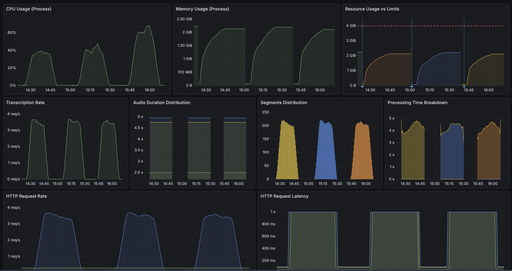

```bash
  █ THRESHOLDS 

    http_req_duration
    ✓ 'p(95)<180000' p(95)=46.31s

    http_req_failed
    ✓ 'rate<0.05' rate=0.00%

    transcription_success
    ✓ 'rate>0.95' rate=100.00%


  █ TOTAL RESULTS 

    checks_total.......: 19150   15.844205/s
    checks_succeeded...: 100.00% 19150 out of 19150
    checks_failed......: 0.00%   0 out of 19150

    ✓ status is 200
    ✓ has original_text
    ✓ has translated_text
    ✓ has segments array
    ✓ segments have required fields

    CUSTOM
    audio_file_size_kb.............: min=60.076172 avg=250.514587 med=195.857422 p(90)=516.326172 p(95)=554.607422 p(99)=703.201172 max=729.296875
    audio_files_used...............: 3835    3.172978/s
    segment_count..................: min=0         avg=1.065274   med=1          p(90)=1          p(95)=2          p(99)=2          max=2         
    transcription_length...........: min=36        avg=136.689592 med=111        p(90)=268        p(95)=304        p(99)=369        max=414       
    transcription_success..........: 100.00% 3830 out of 3830
    translation_length.............: min=4         avg=4          med=4          p(90)=4          p(95)=4          p(99)=4          max=4         

    HTTP
    http_req_duration..............: min=1.69s     avg=17.41s     med=13.73s     p(90)=37.6s      p(95)=46.31s     p(99)=1m4s       max=1m19s     
      { expected_response:true }...: min=1.69s     avg=17.41s     med=13.73s     p(90)=37.6s      p(95)=46.31s     p(99)=1m4s       max=1m19s     
    http_req_failed................: 0.00%   0 out of 3830
    http_reqs......................: 3830    3.168841/s

    EXECUTION
    iteration_duration.............: min=3.35s     avg=19.72s     med=15.84s     p(90)=40.14s     p(95)=49.22s     p(99)=1m7s       max=1m22s     
    iterations.....................: 3829    3.168014/s
    vus............................: 1       min=0            max=100
    vus_max........................: 100     min=100          max=100

    NETWORK
    data_received..................: 3.4 MB  2.8 kB/s
    data_sent......................: 986 MB  816 kB/s

running (20m08.6s), 000/100 VUs, 3829 complete and 6 interrupted iterations
stt_load_test ✓ [======================================] 000/100 VUs  20m0s
```

## Local Cluster - 1 Pod with Isloated Processing

- 1 Pod
- NodePort Service
- Load Balanced Requests
- requests:
  - cpu: "1500m"     # 1.5 CPU cores
  - memory: "4608Mi" # 4.5 GB
- limits:
  - cpu: "2000m"     # 2 CPU cores
  - memory: "6Gi"    # 6 Gigabytes of RAM
- date: 2025-11-25 14:27:07

**Findings from Two Separate Test Runs:**

1. **Memory is stable** - After the initial ramp-up (around 14:30), memory plateaus and remains consistent throughout both test runs
2. **Natural cleanup is working** - The "Avg Memory per Worker" graph shows memory dropping from ~256MB back down to ~64MB, indicating Python's garbage collector is functioning properly
3. **No memory leaks** - The flat line in "Python Memory vs K8s Limit" after 14:40 shows memory isn't accumulating over time
4. **Pod resources are stable** - Both CPU and container memory remain constant

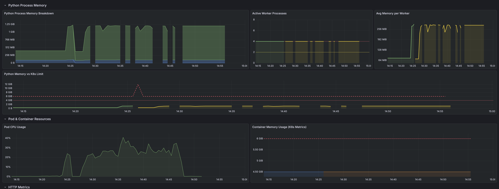

```bash

  █ THRESHOLDS 

    http_req_duration
    ✓ 'p(95)<180000' p(95)=1m1s

    http_req_failed
    ✓ 'rate<0.05' rate=0.00%

    transcription_success
    ✓ 'rate>0.95' rate=100.00%


  █ TOTAL RESULTS 

    checks_total.......: 5195    4.327396/s
    checks_succeeded...: 100.00% 5195 out of 5195
    checks_failed......: 0.00%   0 out of 5195

    ✓ status is 200
    ✓ has original_text
    ✓ has translated_text
    ✓ has segments array
    ✓ segments have required fields

    CUSTOM
    audio_file_size_kb.............: min=60.076172 avg=249.236845 med=184.294922 p(90)=522.419922 p(95)=554.607422 p(99)=729.296875 max=729.296875
    audio_files_used...............: 1046    0.87131/s
    segment_count..................: min=1         avg=1.055823   med=1          p(90)=1          p(95)=2          p(99)=2          max=2         
    transcription_length...........: min=36        avg=135.652551 med=106        p(90)=268        p(95)=291        p(99)=414        max=414       
    transcription_success..........: 100.00% 1039 out of 1039
    translation_length.............: min=36        avg=135.652551 med=106        p(90)=268        p(95)=291        p(99)=414        max=414       

    HTTP
    http_req_duration..............: min=1.89s     avg=33.96s     med=38.87s     p(90)=54.72s     p(95)=1m1s       p(99)=1m7s       max=2m42s     
      { expected_response:true }...: min=1.89s     avg=33.96s     med=38.87s     p(90)=54.72s     p(95)=1m1s       p(99)=1m7s       max=2m42s     
    http_req_failed................: 0.00%   0 out of 1039
    http_reqs......................: 1039    0.865479/s

    EXECUTION
    iteration_duration.............: min=3.38s     avg=36.16s     med=40.95s     p(90)=57.39s     p(95)=1m3s       p(99)=1m10s      max=2m44s     
    iterations.....................: 1038    0.864646/s
    vus............................: 1       min=0            max=50
    vus_max........................: 50      min=50           max=50

    NETWORK
    data_received..................: 1.0 MB  858 B/s
    data_sent......................: 268 MB  223 kB/s

running (20m00.5s), 00/50 VUs, 1038 complete and 8 interrupted iterations
stt_load_test ✓ [======================================] 00/50 VUs  20m0s
```

### Second Test

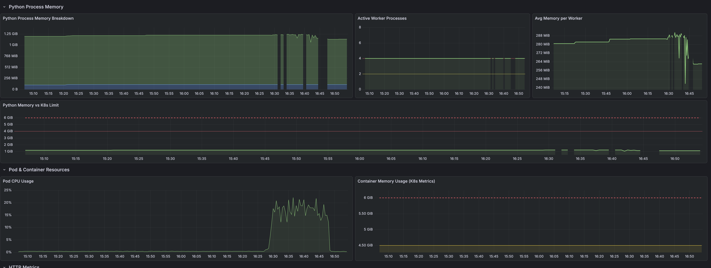

```bash
  █ THRESHOLDS 

    http_req_duration
    ✓ 'p(95)<180000' p(95)=1m18s

    http_req_failed
    ✓ 'rate<0.05' rate=0.00%

    transcription_success
    ✓ 'rate>0.95' rate=100.00%


  █ TOTAL RESULTS 

    checks_total.......: 3660    3.027488/s
    checks_succeeded...: 100.00% 3660 out of 3660
    checks_failed......: 0.00%   0 out of 3660

    ✓ status is 200
    ✓ has original_text
    ✓ has translated_text
    ✓ has segments array
    ✓ segments have required fields

    CUSTOM
    audio_file_size_kb.............: min=60.076172 avg=254.786581 med=196.326172 p(90)=516.326172 p(95)=554.607422 p(99)=729.296875 max=729.296875
    audio_files_used...............: 751     0.621214/s
    segment_count..................: min=0         avg=0          med=0          p(90)=0          p(95)=0          p(99)=0          max=0         
    transcription_success..........: 100.00% 732 out of 732

    HTTP
    http_req_duration..............: min=586.63ms  avg=48.53s     med=53.9s      p(90)=1m16s      p(95)=1m18s      p(99)=1m25s      max=2m38s     
      { expected_response:true }...: min=586.63ms  avg=48.53s     med=53.9s      p(90)=1m16s      p(95)=1m18s      p(99)=1m25s      max=2m38s     
    http_req_failed................: 0.00%   0 out of 732
    http_reqs......................: 732     0.605498/s

    EXECUTION
    iteration_duration.............: min=2.22s     avg=50.76s     med=56s        p(90)=1m18s      p(95)=1m20s      p(99)=1m27s      max=2m41s     
    iterations.....................: 730     0.603843/s
    vus............................: 1       min=0          max=50
    vus_max........................: 50      min=50         max=50

    NETWORK
    data_received..................: 354 kB  293 B/s
    data_sent......................: 196 MB  162 kB/s

running (20m08.9s), 00/50 VUs, 730 complete and 21 interrupted iterations
stt_load_test ✓ [======================================] 00/50 VUs  20m0s
```

## Local Cluster - Transcriptions Service with ThreadPoolExecutor

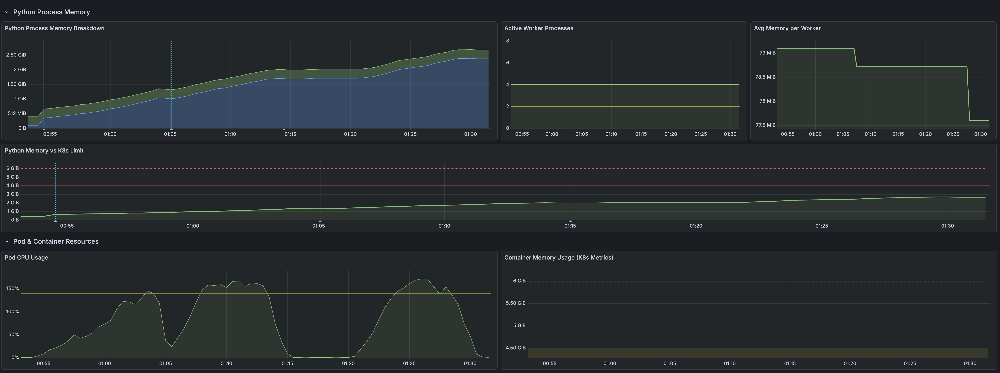

### 1st Run

```bash
  █ THRESHOLDS 

    http_req_duration
    ✓ 'p(95)<180000' p(95)=8.92s

    http_req_failed
    ✓ 'rate<0.05' rate=0.00%

    transcription_success
    ✓ 'rate>0.95' rate=100.00%


  █ TOTAL RESULTS 

    checks_total.......: 12535   19.85751/s
    checks_succeeded...: 100.00% 12535 out of 12535
    checks_failed......: 0.00%   0 out of 12535

    ✓ status is 200
    ✓ has original_text
    ✓ has translated_text
    ✓ has segments array
    ✓ segments have required fields

    CUSTOM
    audio_file_size_kb.............: min=60.076172 avg=259.462248 med=198.513672 p(90)=522.419922 p(95)=554.607422 p(99)=703.201172 max=729.296875
    audio_files_used...............: 2542    4.026948/s
    segment_count..................: min=0         avg=1.069007   med=1          p(90)=1          p(95)=2          p(99)=2          max=2         
    transcription_length...........: min=36        avg=140.838594 med=117        p(90)=272        p(95)=291        p(99)=369        max=414       
    transcription_success..........: 100.00% 2507 out of 2507
    translation_length.............: min=4         avg=4          med=4          p(90)=4          p(95)=4          p(99)=4          max=4         

    HTTP
    http_req_duration..............: min=1.63s     avg=4.09s      med=3.1s       p(90)=7.25s      p(95)=8.92s      p(99)=12.95s     max=17.99s    
      { expected_response:true }...: min=1.63s     avg=4.09s      med=3.1s       p(90)=7.25s      p(95)=8.92s      p(99)=12.95s     max=17.99s    
    http_req_failed................: 0.00%   0 out of 2507
    http_reqs......................: 2507    3.971502/s

    EXECUTION
    iteration_duration.............: min=3s        avg=6.35s      med=5.48s      p(90)=9.89s      p(95)=11.62s     p(99)=14.89s     max=19.84s    
    iterations.....................: 2492    3.94774/s
    vus............................: 50      min=0            max=50
    vus_max........................: 50      min=50           max=50

    NETWORK
    data_received..................: 2.3 MB  3.6 kB/s
    data_sent......................: 677 MB  1.1 MB/s

running (0h10m31.3s), 00/50 VUs, 2492 complete and 50 interrupted iterations

```

### 2nd Run

```bash
  █ THRESHOLDS 

    http_req_duration
    ✓ 'p(95)<180000' p(95)=10.59s

    http_req_failed
    ✓ 'rate<0.05' rate=0.00%

    transcription_success
    ✓ 'rate>0.95' rate=100.00%


  █ TOTAL RESULTS 

    checks_total.......: 16085   26.431592/s
    checks_succeeded...: 100.00% 16085 out of 16085
    checks_failed......: 0.00%   0 out of 16085

    ✓ status is 200
    ✓ has original_text
    ✓ has translated_text
    ✓ has segments array
    ✓ segments have required fields

    CUSTOM
    audio_file_size_kb.............: min=60.076172 avg=252.784021 med=196.326172 p(90)=516.326172 p(95)=554.607422 p(99)=703.201172 max=729.296875
    audio_files_used...............: 3217    5.286318/s
    segment_count..................: min=0         avg=1.064035   med=1          p(90)=1          p(95)=2          p(99)=2          max=2         
    transcription_length...........: min=36        avg=137.888025 med=116        p(90)=272        p(95)=294.9      p(99)=369        max=414       
    transcription_success..........: 100.00% 3217 out of 3217
    translation_length.............: min=4         avg=4          med=4          p(90)=4          p(95)=4          p(99)=4          max=4         

    HTTP
    http_req_duration..............: min=1.77s     avg=4.76s      med=3.76s      p(90)=8.77s      p(95)=10.59s     p(99)=15.22s     max=28.69s    
      { expected_response:true }...: min=1.77s     avg=4.76s      med=3.76s      p(90)=8.77s      p(95)=10.59s     p(99)=15.22s     max=28.69s    
    http_req_failed................: 0.00%   0 out of 3217
    http_reqs......................: 3217    5.286318/s

    EXECUTION
    iteration_duration.............: min=2.92s     avg=7.03s      med=6.01s      p(90)=11.35s     p(95)=13.32s     p(99)=17.56s     max=31.05s    
    iterations.....................: 3217    5.286318/s
    vus............................: 1       min=0            max=50
    vus_max........................: 50      min=50           max=50

    NETWORK
    data_received..................: 2.9 MB  4.7 kB/s
    data_sent......................: 835 MB  1.4 MB/s

running (10m08.6s), 00/50 VUs, 3217 complete and 0 interrupted iterations
stt_load_test ✓ [======================================] 00/50 VUs  10m0s

```

### 3rd Run

```bash
  █ THRESHOLDS 

    http_req_duration
    ✓ 'p(95)<180000' p(95)=11.51s

    http_req_failed
    ✓ 'rate<0.05' rate=0.00%

    transcription_success
    ✓ 'rate>0.95' rate=100.00%


  █ TOTAL RESULTS 

    checks_total.......: 15830   25.941711/s
    checks_succeeded...: 100.00% 15830 out of 15830
    checks_failed......: 0.00%   0 out of 15830

    ✓ status is 200
    ✓ has original_text
    ✓ has translated_text
    ✓ has segments array
    ✓ segments have required fields

    CUSTOM
    audio_file_size_kb.............: min=60.076172 avg=256.567224 med=196.326172 p(90)=522.419922 p(95)=554.607422 p(99)=703.201172 max=729.296875
    audio_files_used...............: 3166    5.188342/s
    segment_count..................: min=0         avg=1.067593   med=1          p(90)=1          p(95)=2          p(99)=2          max=2         
    transcription_length...........: min=36        avg=139.464241 med=111        p(90)=272        p(95)=304        p(99)=369        max=414       
    transcription_success..........: 100.00% 3166 out of 3166
    translation_length.............: min=4         avg=4          med=4          p(90)=4          p(95)=4          p(99)=4          max=4         

    HTTP
    http_req_duration..............: min=1.67s     avg=4.85s      med=3.53s      p(90)=9s         p(95)=11.51s     p(99)=16.63s     max=27.37s    
      { expected_response:true }...: min=1.67s     avg=4.85s      med=3.53s      p(90)=9s         p(95)=11.51s     p(99)=16.63s     max=27.37s    
    http_req_failed................: 0.00%   0 out of 3166
    http_reqs......................: 3166    5.188342/s

    EXECUTION
    iteration_duration.............: min=2.99s     avg=7.13s      med=5.8s       p(90)=11.75s     p(95)=14.2s      p(99)=20.22s     max=30.79s    
    iterations.....................: 3166    5.188342/s
    vus............................: 1       min=0            max=50
    vus_max........................: 50      min=50           max=50

    NETWORK
    data_received..................: 2.8 MB  4.6 kB/s
    data_sent......................: 834 MB  1.4 MB/s

running (10m10.2s), 00/50 VUs, 3166 complete and 0 interrupted iterations
stt_load_test ✓ [======================================] 00/50 VUs  10m0s
```

## Local Cluster - Isloated Processing with Increased Pool Size and Worker Recycling

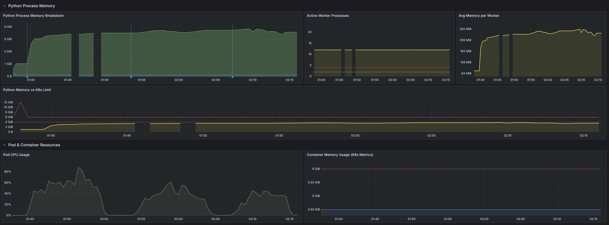

### 1st Run

```bash
  █ THRESHOLDS 

    http_req_duration
    ✓ 'p(95)<180000' p(95)=17.43s

    http_req_failed
    ✓ 'rate<0.05' rate=0.00%

    transcription_success
    ✓ 'rate>0.95' rate=100.00%


  █ TOTAL RESULTS 

    checks_total.......: 8695    14.426228/s
    checks_succeeded...: 100.00% 8695 out of 8695
    checks_failed......: 0.00%   0 out of 8695

    ✓ status is 200
    ✓ has original_text
    ✓ has translated_text
    ✓ has segments array
    ✓ segments have required fields

    CUSTOM
    audio_file_size_kb.............: min=60.076172 avg=249.488296 med=195.857422 p(90)=516.326172 p(95)=566.482422 p(99)=703.201172 max=729.296875
    audio_files_used...............: 1739    2.885246/s
    segment_count..................: min=1         avg=1.06268    med=1          p(90)=1          p(95)=2          p(99)=2          max=2         
    transcription_length...........: min=36        avg=135.765382 med=106        p(90)=272        p(95)=304        p(99)=369        max=414       
    transcription_success..........: 100.00% 1739 out of 1739
    translation_length.............: min=36        avg=135.765382 med=106        p(90)=272        p(95)=304        p(99)=369        max=414       

    HTTP
    http_req_duration..............: min=1.81s     avg=10.84s     med=11.14s     p(90)=15.73s     p(95)=17.43s     p(99)=22.12s     max=2m13s     
      { expected_response:true }...: min=1.81s     avg=10.84s     med=11.14s     p(90)=15.73s     p(95)=17.43s     p(99)=22.12s     max=2m13s     
    http_req_failed................: 0.00%   0 out of 1739
    http_reqs......................: 1739    2.885246/s

    EXECUTION
    iteration_duration.............: min=3.21s     avg=13.05s     med=13.3s      p(90)=18.08s     p(95)=20.11s     p(99)=24.18s     max=2m15s     
    iterations.....................: 1739    2.885246/s
    vus............................: 1       min=0            max=50
    vus_max........................: 50      min=50           max=50

    NETWORK
    data_received..................: 1.8 MB  2.9 kB/s
    data_sent......................: 445 MB  739 kB/s

running (10m02.7s), 00/50 VUs, 1739 complete and 0 interrupted iterations
stt_load_test ✓ [======================================] 00/50 VUs  10m0s
```

### 2nd Run

```bash
  █ THRESHOLDS 

    http_req_duration
    ✓ 'p(95)<180000' p(95)=27.36s

    http_req_failed
    ✓ 'rate<0.05' rate=0.00%

    transcription_success
    ✓ 'rate>0.95' rate=100.00%


  █ TOTAL RESULTS 

    checks_total.......: 6570    10.810653/s
    checks_succeeded...: 100.00% 6570 out of 6570
    checks_failed......: 0.00%   0 out of 6570

    ✓ status is 200
    ✓ has original_text
    ✓ has translated_text
    ✓ has segments array
    ✓ segments have required fields

    CUSTOM
    audio_file_size_kb.............: min=60.076172 avg=263.863299 med=198.513672 p(90)=523.826172 p(95)=651.794922 p(99)=729.296875 max=729.296875
    audio_files_used...............: 1314    2.162131/s
    segment_count..................: min=0         avg=0          med=0          p(90)=0          p(95)=0          p(99)=0          max=0         
    transcription_success..........: 100.00% 1314 out of 1314

    HTTP
    http_req_duration..............: min=570.49ms  avg=15.14s     med=15.04s     p(90)=25.59s     p(95)=27.36s     p(99)=29.08s     max=32.08s    
      { expected_response:true }...: min=570.49ms  avg=15.14s     med=15.04s     p(90)=25.59s     p(95)=27.36s     p(99)=29.08s     max=32.08s    
    http_req_failed................: 0.00%   0 out of 1314
    http_reqs......................: 1314    2.162131/s

    EXECUTION
    iteration_duration.............: min=1.83s     avg=17.35s     med=17.35s     p(90)=27.48s     p(95)=29.38s     p(99)=31.18s     max=34.4s     
    iterations.....................: 1314    2.162131/s
    vus............................: 1       min=0            max=50
    vus_max........................: 50      min=50           max=50

    NETWORK
    data_received..................: 676 kB  1.1 kB/s
    data_sent......................: 356 MB  585 kB/s

running (10m07.7s), 00/50 VUs, 1314 complete and 0 interrupted iterations
stt_load_test ✓ [======================================] 00/50 VUs  10m0s
```

### 3rd Run

```bash
  ```bash
    █ THRESHOLDS 

      http_req_duration
      ✓ 'p(95)<180000' p(95)=25.12s

      http_req_failed
      ✓ 'rate<0.05' rate=0.00%

      transcription_success
      ✓ 'rate>0.95' rate=100.00%


    █ TOTAL RESULTS 

      checks_total.......: 7285    12.015432/s
      checks_succeeded...: 100.00% 7285 out of 7285
      checks_failed......: 0.00%   0 out of 7285

      ✓ status is 200
      ✓ has original_text
      ✓ has translated_text
      ✓ has segments array
      ✓ segments have required fields

      CUSTOM
      audio_file_size_kb.............: min=60.076172 avg=255.298764 med=196.326172 p(90)=520.107422 p(95)=562.150391 p(99)=716.248047 max=729.296875
      audio_files_used...............: 1457    2.403238/s
      segment_count..................: min=0         avg=1.058345   med=1          p(90)=1          p(95)=2          p(99)=2          max=2         
      transcription_length...........: min=36        avg=138.125943 med=111        p(90)=268        p(95)=304        p(99)=390.6      max=414       
      transcription_success..........: 100.00% 1457 out of 1457
      translation_length.............: min=4         avg=4          med=4          p(90)=4          p(95)=4          p(99)=4          max=4         

      HTTP
      http_req_duration..............: min=1.12s     avg=13.78s     med=13.92s     p(90)=22.84s     p(95)=25.12s     p(99)=28.45s     max=31.67s    
        { expected_response:true }...: min=1.12s     avg=13.78s     med=13.92s     p(90)=22.84s     p(95)=25.12s     p(99)=28.45s     max=31.67s    
      http_req_failed................: 0.00%   0 out of 1457
      http_reqs......................: 1457    2.403238/s

      EXECUTION
      iteration_duration.............: min=2.68s     avg=16.12s     med=16.25s     p(90)=25.18s     p(95)=27.84s     p(99)=30.72s     max=33.91s    
      iterations.....................: 1457    2.403238/s
      vus............................: 1       min=0            max=50
      vus_max........................: 50      min=50           max=50

      NETWORK
      data_received..................: 1.4 MB  2.3 kB/s
      data_sent......................: 389 MB  642 kB/s

  running (10m06.3s), 00/50 VUs, 1457 complete and 0 interrupted iterations
  stt_load_test ✓ [======================================] 00/50 VUs  10m0s
```

## Local Cluster - Isloated Processing with Increased Pool Size and Worker Recycling + Periodic Pool Recycling

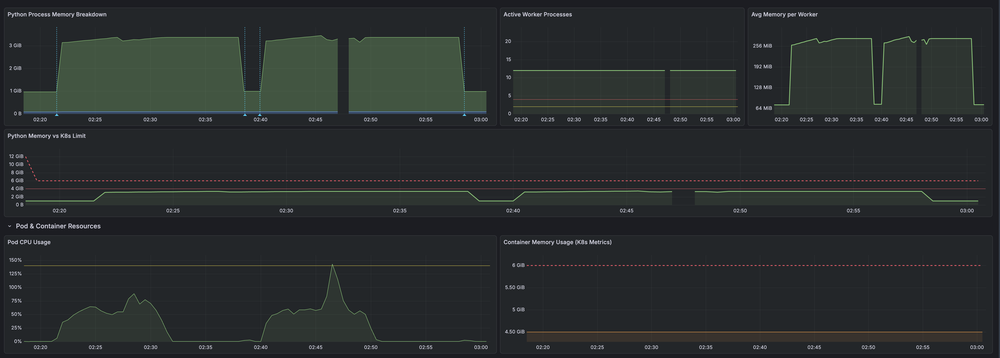

### 1st Run

```bash
  █ THRESHOLDS 

    http_req_duration
    ✓ 'p(95)<180000' p(95)=17.04s

    http_req_failed
    ✓ 'rate<0.05' rate=0.00%

    transcription_success
    ✓ 'rate>0.95' rate=100.00%


  █ TOTAL RESULTS 

    checks_total.......: 8905    14.743185/s
    checks_succeeded...: 100.00% 8905 out of 8905
    checks_failed......: 0.00%   0 out of 8905

    ✓ status is 200
    ✓ has original_text
    ✓ has translated_text
    ✓ has segments array
    ✓ segments have required fields

    CUSTOM
    audio_file_size_kb.............: min=60.076172 avg=258.756707 med=198.513672 p(90)=522.419922 p(95)=554.607422 p(99)=703.201172 max=729.296875
    audio_files_used...............: 1781    2.948637/s
    segment_count..................: min=1         avg=1.076362   med=1          p(90)=1          p(95)=2          p(99)=2          max=2         
    transcription_length...........: min=36        avg=141.413812 med=119        p(90)=268        p(95)=304        p(99)=369        max=414       
    transcription_success..........: 100.00% 1781 out of 1781
    translation_length.............: min=36        avg=141.413812 med=119        p(90)=268        p(95)=304        p(99)=369        max=414       

    HTTP
    http_req_duration..............: min=1.84s     avg=10.53s     med=10.79s     p(90)=15.36s     p(95)=17.04s     p(99)=20.32s     max=28.65s    
      { expected_response:true }...: min=1.84s     avg=10.53s     med=10.79s     p(90)=15.36s     p(95)=17.04s     p(99)=20.32s     max=28.65s    
    http_req_failed................: 0.00%   0 out of 1781
    http_reqs......................: 1781    2.948637/s

    EXECUTION
    iteration_duration.............: min=3.16s     avg=12.73s     med=12.97s     p(90)=17.79s     p(95)=19.24s     p(99)=22.72s     max=31.78s    
    iterations.....................: 1781    2.948637/s
    vus............................: 2       min=0            max=50
    vus_max........................: 50      min=50           max=50

    NETWORK
    data_received..................: 1.9 MB  3.1 kB/s
    data_sent......................: 473 MB  783 kB/s


running (10m04.0s), 00/50 VUs, 1781 complete and 0 interrupted iterations
stt_load_test ✓ [======================================] 00/50 VUs  10m0s
```

### 2nd Run

```bash
  █ THRESHOLDS 

    http_req_duration
    ✓ 'p(95)<180000' p(95)=17.62s

    http_req_failed
    ✓ 'rate<0.05' rate=0.00%

    transcription_success
    ✓ 'rate>0.95' rate=100.00%


  █ TOTAL RESULTS 

    checks_total.......: 8900    14.728016/s
    checks_succeeded...: 100.00% 8900 out of 8900
    checks_failed......: 0.00%   0 out of 8900

    ✓ status is 200
    ✓ has original_text
    ✓ has translated_text
    ✓ has segments array
    ✓ segments have required fields

    CUSTOM
    audio_file_size_kb.............: min=60.076172 avg=250.688988 med=195.857422 p(90)=516.326172 p(95)=554.607422 p(99)=703.201172 max=729.296875
    audio_files_used...............: 1780    2.945603/s
    segment_count..................: min=0         avg=1.059551   med=1          p(90)=1          p(95)=2          p(99)=2          max=2         
    transcription_length...........: min=36        avg=136.667229 med=111        p(90)=268        p(95)=291        p(99)=369        max=414       
    transcription_success..........: 100.00% 1780 out of 1780
    translation_length.............: min=36        avg=136.667229 med=111        p(90)=268        p(95)=291        p(99)=369        max=414       

    HTTP
    http_req_duration..............: min=1.84s     avg=10.52s     med=11.07s     p(90)=15.93s     p(95)=17.62s     p(99)=21.33s     max=2m16s     
      { expected_response:true }...: min=1.84s     avg=10.52s     med=11.07s     p(90)=15.93s     p(95)=17.62s     p(99)=21.33s     max=2m16s     
    http_req_failed................: 0.00%   0 out of 1780
    http_reqs......................: 1780    2.945603/s

    EXECUTION
    iteration_duration.............: min=3.24s     avg=12.73s     med=13.14s     p(90)=18.24s     p(95)=20.16s     p(99)=23.76s     max=2m19s     
    iterations.....................: 1780    2.945603/s
    vus............................: 1       min=0            max=50
    vus_max........................: 50      min=50           max=50

    NETWORK
    data_received..................: 1.8 MB  3.0 kB/s
    data_sent......................: 458 MB  758 kB/s

running (10m04.3s), 00/50 VUs, 1780 complete and 0 interrupted iterations
stt_load_test ✓ [======================================] 00/50 VUs  10m0s
```

## Local Cluster - Isloated Processing with Increased Pool Size and Worker Recycling + Periodic Pool Recycling + New Idle Checks

## 1st Run

```
  █ THRESHOLDS 

    http_req_duration
    ✓ 'p(95)<180000' p(95)=18.38s

    http_req_failed
    ✓ 'rate<0.05' rate=0.00%

    transcription_success
    ✓ 'rate>0.95' rate=100.00%


  █ TOTAL RESULTS 

    checks_total.......: 7860    13.014903/s
    checks_succeeded...: 100.00% 7860 out of 7860
    checks_failed......: 0.00%   0 out of 7860

    ✓ status is 200
    ✓ has original_text
    ✓ has translated_text
    ✓ has segments array
    ✓ segments have required fields

    CUSTOM
    audio_file_size_kb.............: min=60.076172 avg=258.642207 med=196.326172 p(90)=523.826172 p(95)=566.482422 p(99)=703.201172 max=729.296875
    audio_files_used...............: 1572    2.602981/s
    segment_count..................: min=1         avg=1.076972   med=1          p(90)=1          p(95)=2          p(99)=2          max=2         
    transcription_length...........: min=36        avg=140.528626 med=116        p(90)=272        p(95)=291        p(99)=369        max=414       
    transcription_success..........: 100.00% 1572 out of 1572
    translation_length.............: min=36        avg=140.528626 med=116        p(90)=272        p(95)=291        p(99)=369        max=414       

    HTTP
    http_req_duration..............: min=1.87s     avg=12.22s     med=12.15s     p(90)=16.78s     p(95)=18.38s     p(99)=22.84s     max=2m19s     
      { expected_response:true }...: min=1.87s     avg=12.22s     med=12.15s     p(90)=16.78s     p(95)=18.38s     p(99)=22.84s     max=2m19s     
    http_req_failed................: 0.00%   0 out of 1572
    http_reqs......................: 1572    2.602981/s

    EXECUTION
    iteration_duration.............: min=3.07s     avg=14.45s     med=14.3s      p(90)=19.26s     p(95)=20.95s     p(99)=25.2s      max=2m20s     
    iterations.....................: 1572    2.602981/s
    vus............................: 1       min=0            max=50
    vus_max........................: 50      min=50           max=50

    NETWORK
    data_received..................: 1.6 MB  2.7 kB/s
    data_sent......................: 417 MB  691 kB/s

running (10m03.9s), 00/50 VUs, 1572 complete and 0 interrupted iterations
stt_load_test ✓ [======================================] 00/50 VUs  10m0s
```

## 2nd Run

```
  █ THRESHOLDS 

    http_req_duration
    ✓ 'p(95)<180000' p(95)=17.85s

    http_req_failed
    ✓ 'rate<0.05' rate=0.00%

    transcription_success
    ✓ 'rate>0.95' rate=100.00%


  █ TOTAL RESULTS 

    checks_total.......: 8500    13.89984/s
    checks_succeeded...: 100.00% 8500 out of 8500
    checks_failed......: 0.00%   0 out of 8500

    ✓ status is 200
    ✓ has original_text
    ✓ has translated_text
    ✓ has segments array
    ✓ segments have required fields

    CUSTOM
    audio_file_size_kb.............: min=60.076172 avg=254.024511 med=196.326172 p(90)=506.951172 p(95)=554.607422 p(99)=703.201172 max=729.296875
    audio_files_used...............: 1701    2.781603/s
    segment_count..................: min=0         avg=0.954118   med=1          p(90)=1          p(95)=2          p(99)=2          max=2         
    transcription_length...........: min=36        avg=137.624021 med=117        p(90)=267        p(95)=291        p(99)=369        max=414       
    transcription_success..........: 100.00% 1700 out of 1700
    translation_length.............: min=36        avg=137.624021 med=117        p(90)=267        p(95)=291        p(99)=369        max=414       

    HTTP
    http_req_duration..............: min=585.53ms  avg=11.13s     med=11.57s     p(90)=16.02s     p(95)=17.85s     p(99)=21.03s     max=2m11s     
      { expected_response:true }...: min=585.53ms  avg=11.13s     med=11.57s     p(90)=16.02s     p(95)=17.85s     p(99)=21.03s     max=2m11s     
    http_req_failed................: 0.00%   0 out of 1700
    http_reqs......................: 1700    2.779968/s

    EXECUTION
    iteration_duration.............: min=1.92s     avg=13.32s     med=13.67s     p(90)=18.33s     p(95)=20.18s     p(99)=23.18s     max=2m13s     
    iterations.....................: 1700    2.779968/s
    vus............................: 1       min=0            max=50
    vus_max........................: 50      min=50           max=50

    NETWORK
    data_received..................: 1.7 MB  2.7 kB/s
    data_sent......................: 443 MB  725 kB/s

running (10m11.5s), 00/50 VUs, 1700 complete and 1 interrupted iterations
stt_load_test ✓ [======================================] 00/50 VUs  10m0s
```

## 3rd Run

```
  █ THRESHOLDS 

    http_req_duration
    ✓ 'p(95)<180000' p(95)=26.64s

    http_req_failed
    ✓ 'rate<0.05' rate=0.00%

    transcription_success
    ✓ 'rate>0.95' rate=100.00%


  █ TOTAL RESULTS 

    checks_total.......: 6405    10.603868/s
    checks_succeeded...: 100.00% 6405 out of 6405
    checks_failed......: 0.00%   0 out of 6405

    ✓ status is 200
    ✓ has original_text
    ✓ has translated_text
    ✓ has segments array
    ✓ segments have required fields

    CUSTOM
    audio_file_size_kb.............: min=60.076172 avg=257.991637 med=196.326172 p(90)=523.826172 p(95)=566.482422 p(99)=703.201172 max=729.296875
    audio_files_used...............: 1281    2.120774/s
    segment_count..................: min=0         avg=0          med=0          p(90)=0          p(95)=0          p(99)=0          max=0         
    transcription_success..........: 100.00% 1281 out of 1281

    HTTP
    http_req_duration..............: min=578.99ms  avg=15.65s     med=15.36s     p(90)=25.5s      p(95)=26.64s     p(99)=29.75s     max=1m28s     
      { expected_response:true }...: min=578.99ms  avg=15.65s     med=15.36s     p(90)=25.5s      p(95)=26.64s     p(99)=29.75s     max=1m28s     
    http_req_failed................: 0.00%   0 out of 1281
    http_reqs......................: 1281    2.120774/s

    EXECUTION
    iteration_duration.............: min=1.76s     avg=17.83s     med=17.47s     p(90)=27.58s     p(95)=28.71s     p(99)=31.71s     max=1m30s     
    iterations.....................: 1281    2.120774/s
    vus............................: 1       min=0            max=50
    vus_max........................: 50      min=50           max=50

    NETWORK
    data_received..................: 659 kB  1.1 kB/s
    data_sent......................: 339 MB  562 kB/s

running (10m04.0s), 00/50 VUs, 1281 complete and 0 interrupted iterations
stt_load_test ✓ [======================================] 00/50 VUs  10m0s
```

## Local Cluster - Isloated Processing with Increased Pool Size and Worker Recycling + Periodic Pool Recycling + New Idle Checks

2 replicas
100 VUs

### 1st Run

```
  █ THRESHOLDS 

    http_req_duration
    ✓ 'p(95)<180000' p(95)=22.33s

    http_req_failed
    ✓ 'rate<0.05' rate=0.00%

    transcription_success
    ✓ 'rate>0.95' rate=100.00%


  █ TOTAL RESULTS 

    checks_total.......: 15535   25.842953/s
    checks_succeeded...: 100.00% 15535 out of 15535
    checks_failed......: 0.00%   0 out of 15535

    ✓ status is 200
    ✓ has original_text
    ✓ has translated_text
    ✓ has segments array
    ✓ segments have required fields

    CUSTOM
    audio_file_size_kb.............: min=60.076172 avg=252.513426 med=195.857422 p(90)=516.326172 p(95)=554.607422 p(99)=703.201172 max=729.296875
    audio_files_used...............: 3107    5.168591/s
    segment_count..................: min=1         avg=1.069842   med=1          p(90)=1          p(95)=2          p(99)=2          max=2         
    transcription_length...........: min=36        avg=137.584808 med=111        p(90)=268        p(95)=300.1      p(99)=369        max=414       
    transcription_success..........: 100.00% 3107 out of 3107
    translation_length.............: min=36        avg=137.584808 med=111        p(90)=268        p(95)=300.1      p(99)=369        max=414       

    HTTP
    http_req_duration..............: min=1.79s     avg=12.25s     med=11.81s     p(90)=19.19s     p(95)=22.33s     p(99)=27.28s     max=2m16s     
      { expected_response:true }...: min=1.79s     avg=12.25s     med=11.81s     p(90)=19.19s     p(95)=22.33s     p(99)=27.28s     max=2m16s     
    http_req_failed................: 0.00%   0 out of 3107
    http_reqs......................: 3107    5.168591/s

    EXECUTION
    iteration_duration.............: min=2.98s     avg=14.6s      med=14.13s     p(90)=21.86s     p(95)=25.06s     p(99)=30.46s     max=2m11s     
    iterations.....................: 3106    5.166927/s
    vus............................: 2       min=0            max=100
    vus_max........................: 100     min=100          max=100

    NETWORK
    data_received..................: 3.2 MB  5.3 kB/s
    data_sent......................: 805 MB  1.3 MB/s

running (10m01.1s), 000/100 VUs, 3106 complete and 1 interrupted iterations
stt_load_test ✓ [======================================] 000/100 VUs  10m0s
```

### 2nd Run

```
  █ THRESHOLDS 

    http_req_duration
    ✓ 'p(95)<180000' p(95)=25.13s

    http_req_failed
    ✓ 'rate<0.05' rate=0.00%

    transcription_success
    ✓ 'rate>0.95' rate=100.00%


  █ TOTAL RESULTS 

    checks_total.......: 14595   23.343109/s
    checks_succeeded...: 100.00% 14595 out of 14595
    checks_failed......: 0.00%   0 out of 14595

    ✓ status is 200
    ✓ has original_text
    ✓ has translated_text
    ✓ has segments array
    ✓ segments have required fields

    CUSTOM
    audio_file_size_kb.............: min=60.076172 avg=252.336359 med=195.857422 p(90)=516.935547 p(95)=555.201172 p(99)=724.338691 max=729.296875
    audio_files_used...............: 2920    4.670221/s
    segment_count..................: min=0         avg=1.072285   med=1          p(90)=1          p(95)=2          p(99)=2          max=2         
    transcription_length...........: min=36        avg=137.370586 med=108        p(90)=268        p(95)=291        p(99)=406.8      max=414       
    transcription_success..........: 100.00% 2919 out of 2919
    translation_length.............: min=36        avg=137.370586 med=108        p(90)=268        p(95)=291        p(99)=406.8      max=414       

    HTTP
    http_req_duration..............: min=1.87s     avg=12.99s     med=11.44s     p(90)=22.59s     p(95)=25.13s     p(99)=30.61s     max=2m27s     
      { expected_response:true }...: min=1.87s     avg=12.99s     med=11.44s     p(90)=22.59s     p(95)=25.13s     p(99)=30.61s     max=2m27s     
    http_req_failed................: 0.00%   0 out of 2919
    http_reqs......................: 2919    4.668622/s

    EXECUTION
    iteration_duration.............: min=3.26s     avg=15.62s     med=14.21s     p(90)=25.65s     p(95)=28.23s     p(99)=34.28s     max=2m30s     
    iterations.....................: 2918    4.667022/s
    vus............................: 1       min=0            max=100
    vus_max........................: 100     min=100          max=100

    NETWORK
    data_received..................: 3.0 MB  4.8 kB/s
    data_sent......................: 756 MB  1.2 MB/s

running (10m25.2s), 000/100 VUs, 2918 complete and 2 interrupted iterations
stt_load_test ✓ [======================================] 000/100 VUs  10m0s
```

## Local Cluster - JavaSDK Implementation

1 replica
50VUs

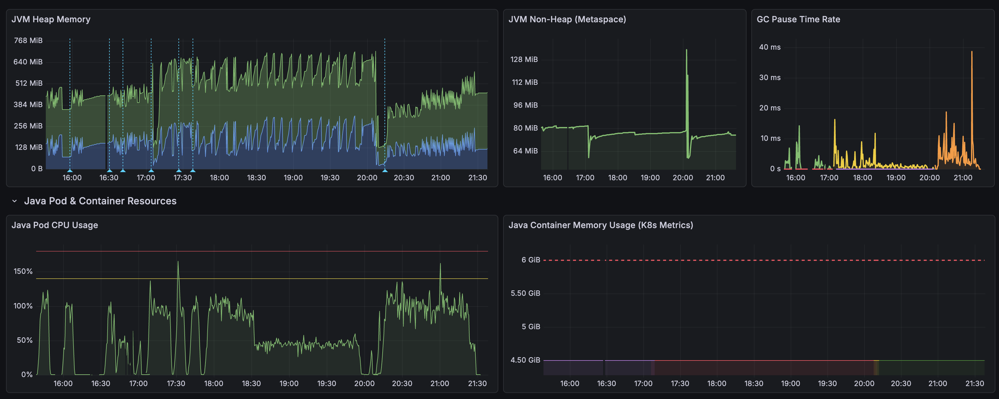

- Heap Utilization: Only 10-12% of Available
  - -XX:MaxRAMPercentage=75
  - Container Memory: 6,144 MiB (6 GiB)
  - Max Heap = 6,144 × 0.75 = 4,608 MiB (~4.5 GB)
- 10,588 requests over 2.5 hours
- Peak heap: 512 MiB
- Memory per request: ~0.05 MiB (50 KB)
- Memory usage is bounded and predictable
- GC is highly efficient with minimal overhead
- Native memory (Azure SDK) is stable, not leaking
- System can handle current load with 7x headroom
- Performance is consistent over extended periods

## 1st Run

```
  █ THRESHOLDS 

    http_req_duration
    ✓ 'p(95)<180000' p(95)=11.76s

    http_req_failed
    ✓ 'rate<0.05' rate=0.00%

    transcription_success
    ✓ 'rate>0.95' rate=100.00%


  █ TOTAL RESULTS 

    checks_total.......: 15300   25.367008/s
    checks_succeeded...: 100.00% 15300 out of 15300
    checks_failed......: 0.00%   0 out of 15300

    ✓ status is 200
    ✓ has original_text
    ✓ has translated_text
    ✓ has segments array
    ✓ segments have required fields

    CUSTOM
    audio_file_size_kb.............: min=60.076172 avg=256.045762 med=196.326172 p(90)=516.326172 p(95)=566.482422 p(99)=729.296875 max=729.296875
    audio_files_used...............: 3060    5.073402/s
    segment_count..................: min=0         avg=1.35915    med=1          p(90)=3          p(95)=3          p(99)=3          max=4         
    transcription_length...........: min=22        avg=124.507218 med=103        p(90)=254        p(95)=283        p(99)=386        max=386       
    transcription_success..........: 100.00% 3060 out of 3060
    translation_length.............: min=22        avg=124.507218 med=103        p(90)=254        p(95)=283        p(99)=386        max=386       

    HTTP
    http_req_duration..............: min=1.61s     avg=5.12s      med=4.01s      p(90)=9.47s      p(95)=11.76s     p(99)=17.14s     max=31.41s    
      { expected_response:true }...: min=1.61s     avg=5.12s      med=4.01s      p(90)=9.47s      p(95)=11.76s     p(99)=17.14s     max=31.41s    
    http_req_failed................: 0.00%   0 out of 3060
    http_reqs......................: 3060    5.073402/s

    EXECUTION
    iteration_duration.............: min=2.9s      avg=7.37s      med=6.33s      p(90)=11.98s     p(95)=14.49s     p(99)=19.57s     max=33.95s    
    iterations.....................: 3060    5.073402/s
    vus............................: 1       min=0            max=50
    vus_max........................: 50      min=50           max=50

    NETWORK
    data_received..................: 2.9 MB  4.9 kB/s
    data_sent......................: 804 MB  1.3 MB/s

running (10m03.1s), 00/50 VUs, 3060 complete and 0 interrupted iterations
stt_load_test ✓ [======================================] 00/50 VUs  10m0s
```

## 2nd Run

```
  █ THRESHOLDS 

    http_req_duration
    ✓ 'p(95)<180000' p(95)=8.86s

    http_req_failed
    ✓ 'rate<0.05' rate=0.00%

    transcription_success
    ✓ 'rate>0.95' rate=100.00%


  █ TOTAL RESULTS 

    checks_total.......: 18890   30.858503/s
    checks_succeeded...: 100.00% 18890 out of 18890
    checks_failed......: 0.00%   0 out of 18890

    ✓ status is 200
    ✓ has original_text
    ✓ has translated_text
    ✓ has segments array
    ✓ segments have required fields

    CUSTOM
    audio_file_size_kb.............: min=60.076172 avg=260.987471 med=196.326172 p(90)=522.419922 p(95)=566.482422 p(99)=729.296875 max=729.296875
    audio_files_used...............: 3778    6.171701/s
    segment_count..................: min=0         avg=1.381683   med=1          p(90)=3          p(95)=3          p(99)=3          max=4         
    transcription_length...........: min=22        avg=126.973782 med=103        p(90)=258        p(95)=283        p(99)=386        max=386       
    transcription_success..........: 100.00% 3778 out of 3778
    translation_length.............: min=22        avg=126.973782 med=103        p(90)=258        p(95)=283        p(99)=386        max=386       

    HTTP
    http_req_duration..............: min=1.35s     avg=3.75s      med=2.65s      p(90)=7.04s      p(95)=8.86s      p(99)=12.13s     max=16.11s    
      { expected_response:true }...: min=1.35s     avg=3.75s      med=2.65s      p(90)=7.04s      p(95)=8.86s      p(99)=12.13s     max=16.11s    
    http_req_failed................: 0.00%   0 out of 3778
    http_reqs......................: 3778    6.171701/s

    EXECUTION
    iteration_duration.............: min=2.53s     avg=5.98s      med=5.04s      p(90)=9.57s      p(95)=11.39s     p(99)=13.97s     max=19.48s    
    iterations.....................: 3778    6.171701/s
    vus............................: 1       min=0            max=50
    vus_max........................: 50      min=50           max=50

    NETWORK
    data_received..................: 3.7 MB  6.0 kB/s
    data_sent......................: 1.0 GB  1.7 MB/s

running (10m12.1s), 00/50 VUs, 3778 complete and 0 interrupted iterations
stt_load_test ✓ [======================================] 00/50 VUs  10m0s
```

## 3rd Run

```
  █ THRESHOLDS 

    http_req_duration
    ✓ 'p(95)<180000' p(95)=8.91s

    http_req_failed
    ✓ 'rate<0.05' rate=0.02%

    transcription_success
    ✓ 'rate>0.95' rate=99.97%


  █ TOTAL RESULTS 

    checks_total.......: 18750  31.08157/s
    checks_succeeded...: 99.97% 18745 out of 18750
    checks_failed......: 0.02%  5 out of 18750

    ✗ status is 200
      ↳  99% — ✓ 3749 / ✗ 1
    ✗ has original_text
      ↳  99% — ✓ 3749 / ✗ 1
    ✗ has translated_text
      ↳  99% — ✓ 3749 / ✗ 1
    ✗ has segments array
      ↳  99% — ✓ 3749 / ✗ 1
    ✗ segments have required fields
      ↳  99% — ✓ 3749 / ✗ 1

    CUSTOM
    audio_file_size_kb.............: min=60.076172 avg=256.715817 med=196.326172 p(90)=522.419922 p(95)=566.482422 p(99)=716.50998 max=729.296875
    audio_files_used...............: 3750   6.216314/s
    segment_count..................: min=0         avg=1.339824   med=1          p(90)=3          p(95)=3          p(99)=3         max=4         
    transcription_length...........: min=22        avg=124.851268 med=103        p(90)=256        p(95)=283        p(99)=366.2     max=386       
    transcription_success..........: 99.97% 3749 out of 3750
    translation_length.............: min=22        avg=124.851268 med=103        p(90)=256        p(95)=283        p(99)=366.2     max=386       

    HTTP
    http_req_duration..............: min=1.36s     avg=3.81s      med=2.61s      p(90)=7.05s      p(95)=8.91s      p(99)=13s       max=3m0s      
      { expected_response:true }...: min=1.36s     avg=3.76s      med=2.61s      p(90)=7.05s      p(95)=8.91s      p(99)=12.92s    max=18.17s    
    http_req_failed................: 0.02%  1 out of 3750
    http_reqs......................: 3750   6.216314/s

    EXECUTION
    iteration_duration.............: min=2.47s     avg=6.02s      med=4.98s      p(90)=9.69s      p(95)=11.64s     p(99)=15.57s    max=3m2s      
    iterations.....................: 3750   6.216314/s
    vus............................: 2      min=0            max=50
    vus_max........................: 50     min=50           max=50

    NETWORK
    data_received..................: 3.6 MB 6.0 kB/s
    data_sent......................: 988 MB 1.6 MB/s

running (10m03.3s), 00/50 VUs, 3750 complete and 0 interrupted iterations
stt_load_test ✓ [======================================] 00/50 VUs  10m0s
```

## 4th Run

```

  █ THRESHOLDS 

    http_req_duration
    ✓ 'p(95)<180000' p(95)=9.45s

    http_req_failed
    ✓ 'rate<0.05' rate=0.00%

    transcription_success
    ✓ 'rate>0.95' rate=100.00%


  █ TOTAL RESULTS 

    checks_total.......: 43200   35.838347/s
    checks_succeeded...: 100.00% 43200 out of 43200
    checks_failed......: 0.00%   0 out of 43200

    ✓ status is 200
    ✓ has original_text
    ✓ has translated_text
    ✓ has segments array
    ✓ segments have required fields

    CUSTOM
    audio_file_size_kb.............: min=60.076172 avg=252.092668 med=195.857422 p(90)=516.326172 p(95)=566.482422 p(99)=729.296875 max=729.296875
    audio_files_used...............: 8640    7.167669/s
    segment_count..................: min=0         avg=1.351968   med=1          p(90)=3          p(95)=3          p(99)=3          max=4         
    transcription_length...........: min=22        avg=122.604145 med=97         p(90)=255        p(95)=283        p(99)=386        max=386       
    transcription_success..........: 100.00% 8640 out of 8640
    translation_length.............: min=22        avg=122.604145 med=97         p(90)=255        p(95)=283        p(99)=386        max=386       

    HTTP
    http_req_duration..............: min=1.37s     avg=3.85s      med=2.65s      p(90)=7.19s      p(95)=9.45s      p(99)=13.69s     max=23.34s    
      { expected_response:true }...: min=1.37s     avg=3.85s      med=2.65s      p(90)=7.19s      p(95)=9.45s      p(99)=13.69s     max=23.34s    
    http_req_failed................: 0.00%   0 out of 8640
    http_reqs......................: 8640    7.167669/s

    EXECUTION
    iteration_duration.............: min=2.66s     avg=6.09s      med=5.06s      p(90)=9.84s      p(95)=12.04s     p(99)=16.37s     max=26.52s    
    iterations.....................: 8640    7.167669/s
    vus............................: 1       min=0            max=50
    vus_max........................: 50      min=50           max=50

    NETWORK
    data_received..................: 8.2 MB  6.8 kB/s
    data_sent......................: 2.2 GB  1.9 MB/s


running (20m05.4s), 00/50 VUs, 8640 complete and 0 interrupted iterations
stt_load_test ✓ [======================================] 00/50 VUs  20m0s
```

## 5th Run

```
  █ THRESHOLDS 

    http_req_duration
    ✓ 'p(95)<180000' p(95)=9.58s

    http_req_failed
    ✓ 'rate<0.05' rate=0.00%

    transcription_success
    ✓ 'rate>0.95' rate=100.00%


  █ TOTAL RESULTS 

    checks_total.......: 18325   30.476834/s
    checks_succeeded...: 100.00% 18325 out of 18325
    checks_failed......: 0.00%   0 out of 18325

    ✓ status is 200
    ✓ has original_text
    ✓ has translated_text
    ✓ has segments array
    ✓ segments have required fields

    CUSTOM
    audio_file_size_kb.............: min=60.076172 avg=257.001925 med=196.326172 p(90)=516.326172 p(95)=554.607422 p(99)=729.296875 max=729.296875
    audio_files_used...............: 3665    6.095367/s
    segment_count..................: min=0         avg=1.329604   med=1          p(90)=3          p(95)=3          p(99)=3          max=4         
    transcription_length...........: min=22        avg=124.96643  med=103        p(90)=255        p(95)=277        p(99)=386        max=386       
    transcription_success..........: 100.00% 3665 out of 3665
    translation_length.............: min=22        avg=124.96643  med=103        p(90)=255        p(95)=277        p(99)=386        max=386       

    HTTP
    http_req_duration..............: min=1.6s      avg=3.93s      med=2.67s      p(90)=7.21s      p(95)=9.58s      p(99)=13.59s     max=36.27s    
      { expected_response:true }...: min=1.6s      avg=3.93s      med=2.67s      p(90)=7.21s      p(95)=9.58s      p(99)=13.59s     max=36.27s    
    http_req_failed................: 0.00%   0 out of 3665
    http_reqs......................: 3665    6.095367/s

    EXECUTION
    iteration_duration.............: min=2.74s     avg=6.17s      med=5.11s      p(90)=9.9s       p(95)=12.31s     p(99)=16.03s     max=37.84s    
    iterations.....................: 3665    6.095367/s
    vus............................: 2       min=0            max=50
    vus_max........................: 50      min=50           max=50

    NETWORK
    data_received..................: 3.5 MB  5.8 kB/s
    data_sent......................: 967 MB  1.6 MB/s

running (10m01.3s), 00/50 VUs, 3665 complete and 0 interrupted iterations
stt_load_test ✓ [======================================] 00/50 VUs  10m0s
```

## 6th Run

```

  █ THRESHOLDS 

    http_req_duration
    ✓ 'p(95)<180000' p(95)=8.87s

    http_req_failed
    ✓ 'rate<0.05' rate=0.00%

    transcription_success
    ✓ 'rate>0.95' rate=100.00%


  █ TOTAL RESULTS 

    checks_total.......: 19305   32.142511/s
    checks_succeeded...: 100.00% 19305 out of 19305
    checks_failed......: 0.00%   0 out of 19305

    ✓ status is 200
    ✓ has original_text
    ✓ has translated_text
    ✓ has segments array
    ✓ segments have required fields

    CUSTOM
    audio_file_size_kb.............: min=60.076172 avg=253.386701 med=195.857422 p(90)=522.419922 p(95)=566.482422 p(99)=713.639453 max=729.296875
    audio_files_used...............: 3861    6.428502/s
    segment_count..................: min=1         avg=1.365708   med=1          p(90)=3          p(95)=3          p(99)=3          max=3         
    transcription_length...........: min=22        avg=122.956488 med=97         p(90)=255        p(95)=283        p(99)=359        max=386       
    transcription_success..........: 100.00% 3861 out of 3861
    translation_length.............: min=22        avg=122.956488 med=97         p(90)=255        p(95)=283        p(99)=359        max=386       

    HTTP
    http_req_duration..............: min=1.36s     avg=3.59s      med=2.51s      p(90)=6.9s       p(95)=8.87s      p(99)=12.6s      max=17.61s    
      { expected_response:true }...: min=1.36s     avg=3.59s      med=2.51s      p(90)=6.9s       p(95)=8.87s      p(99)=12.6s      max=17.61s    
    http_req_failed................: 0.00%   0 out of 3861
    http_reqs......................: 3861    6.428502/s

    EXECUTION
    iteration_duration.............: min=2.78s     avg=5.83s      med=4.92s      p(90)=9.37s      p(95)=11.26s     p(99)=15.01s     max=20.07s    
    iterations.....................: 3861    6.428502/s
    vus............................: 1       min=0            max=50
    vus_max........................: 50      min=50           max=50

    NETWORK
    data_received..................: 3.7 MB  6.2 kB/s
    data_sent......................: 1.0 GB  1.7 MB/s


running (10m00.6s), 00/50 VUs, 3861 complete and 0 interrupted iterations
stt_load_test ✓ [======================================] 00/50 VUs  10m0s
```

## 7th Run

```

```